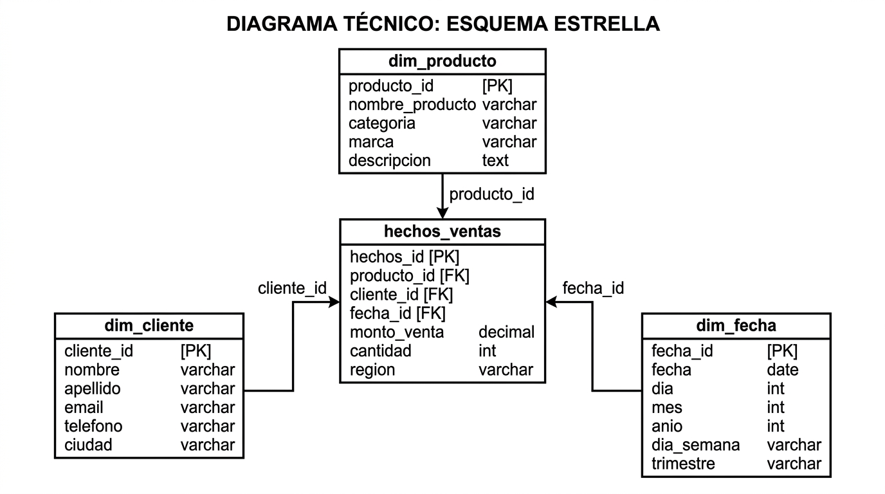
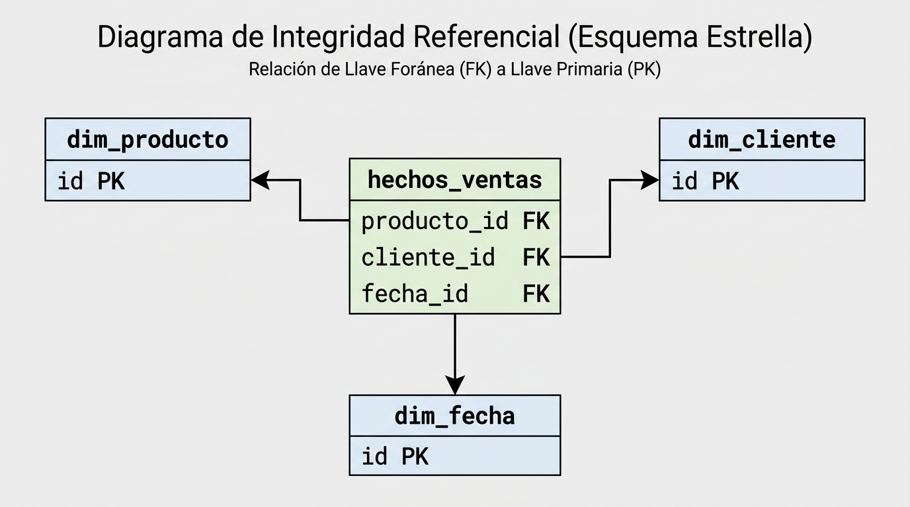
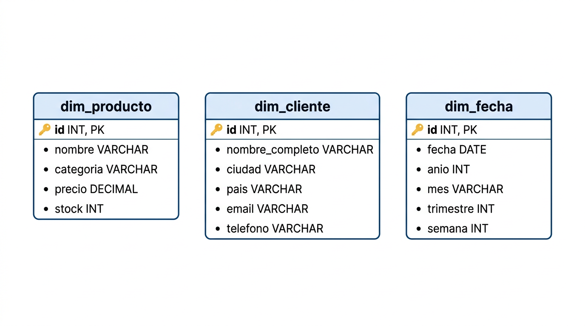
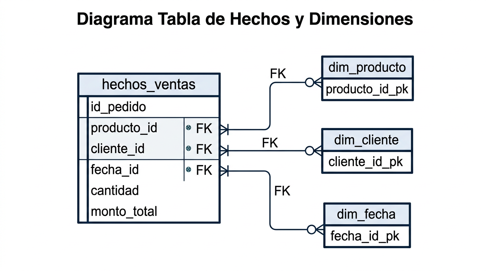
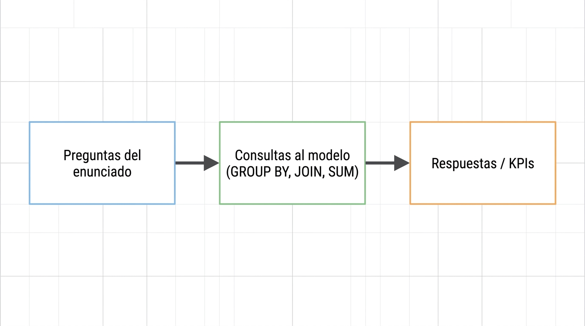

# Decisiones de diseño – Modelado de la base de datos Sistema de Ventas

## 1. Estructura elegida: modelo estrella

Se eligió un **esquema estrella** para el Data Warehouse porque:

- Las consultas analíticas y los KPIs (totales por producto, cliente, mes; top 5 productos/clientes; tendencias) se resuelven con pocos JOINs entre una tabla de hechos y dimensiones.
- Facilita la integración de datos de múltiples fuentes (CSV de productos y clientes, CSV o BD de ventas, API) en un único modelo de reportes.
- El modelo es fácil de explicar y mantener: una tabla de hechos (`hechos_ventas`) y tres dimensiones (`dim_producto`, `dim_cliente`, `dim_fecha`).

## 2. Normalización e integridad

- Las **dimensiones** están desnormalizadas de forma controlada (por ejemplo, categoría y precio en `dim_producto`; ciudad y país en `dim_cliente`) para evitar JOINs adicionales en los reportes.
- La **integridad referencial** se garantiza con claves foráneas en `hechos_ventas` hacia cada dimensión. Todas las claves primarias y foráneas están definidas en el script SQL.

## 3. Definición de dimensiones

- **dim_producto:** Alineada con `products.csv` (ProductID → id, ProductName → nombre, Category → categoria, Price → precio, Stock → stock) para que el ETL pueda cargar desde CSV o API.
- **dim_cliente:** Alineada con `customers.csv` (CustomerID → id, FirstName+LastName → nombre_completo, City → ciudad, Country → pais, Email, Phone) para análisis por país, región o ciudad.
- **dim_fecha:** Tabla de calendario con id numérico en formato YYYYMMDD para rangos y filtros por periodo; incluye año, mes, trimestre y semana para agregaciones temporales.

## 4. Tabla de hechos

- **hechos_ventas:** Cada fila representa una **línea de detalle de venta** (equivalente a una fila en `order_details` más la fecha y el cliente del pedido). Incluye:
  - `id_pedido`: identifica la transacción (pedido) para contar transacciones y promedios por transacción.
  - `producto_id`, `cliente_id`, `fecha_id`: FKs a las dimensiones.
  - `cantidad` y `monto_total`: medidas para totales, promedios y rankings.

Con esta estructura se pueden calcular totales globales, por producto, por cliente y por periodo sin tablas intermedias adicionales.

## 5. Cómo responde el modelo a las preguntas del enunciado

| Bloque del PDF | Cómo se responde con el modelo |
|----------------|--------------------------------|
| **1. Análisis general de ventas** | SUM(`monto_total`) en `hechos_ventas`; promedios y conteos por `fecha_id`; volumen por país/ciudad vía JOIN con `dim_cliente`. |
| **2. Ventas por producto** | Agrupando por `producto_id` (y `dim_producto.categoria`): totales, ingresos, evolución en el tiempo; precio promedio desde `dim_producto`. |
| **3. Ventas por cliente** | Agrupando por `cliente_id`: clientes con más compras, mayor volumen; promedio de productos por transacción usando `id_pedido` y `cantidad`; Top 5 y porcentaje sobre total; segmentos por país/tipo vía `dim_cliente`. |
| **4. Tendencias temporales** | Agrupando por `fecha_id` (o por `dim_fecha.anio`, `mes`, `trimestre`): tendencia mensual/trimestral, picos, estacionalidad, evolución del ingreso. |
| **5. Comparativas y desempeño** | Comparar categorías (dim_producto), regiones/países (dim_cliente), periodos (dim_fecha); porcentaje por categoría; año actual vs anterior usando `dim_fecha.anio`. |
| **6. KPIs** | Total de ventas (SUM), total por producto/cliente/mes (GROUP BY), Top 5 productos/clientes (ORDER BY + LIMIT), promedio por cliente, crecimiento % (comparando periodos en `dim_fecha`). |

## 6. Resumen

El modelo cumple los requisitos mínimos del enunciado: tablas identificadas (dimensiones y hechos), llaves primarias y foráneas definidas, integridad referencial, DER en esquema estrella y script SQL de creación. Las decisiones de diseño priorizan la sencillez de las consultas analíticas y la compatibilidad con los CSV del dataset (`products`, `customers`, `orders`, `order_details`) para una futura carga ETL.
