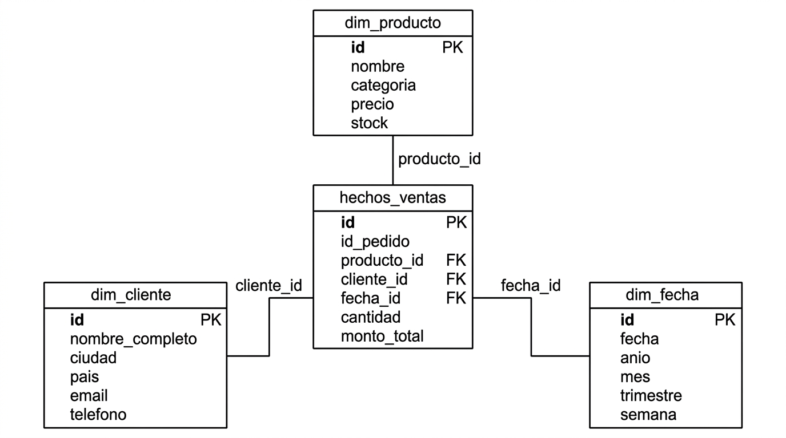
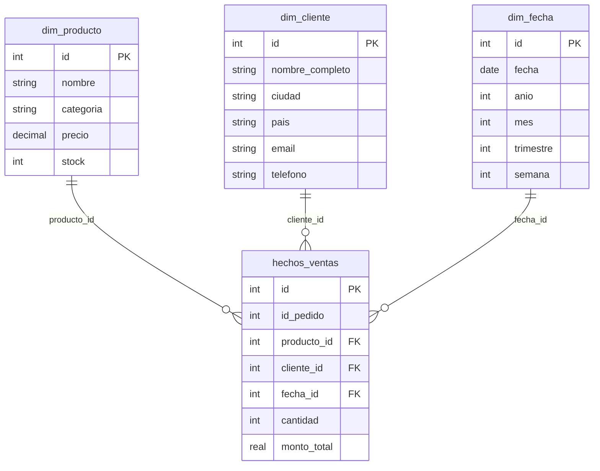

# Diagrama Entidad-Relación – Sistema de Análisis de Ventas

Modelo analítico en forma de **esquema estrella** para el Data Warehouse de ventas. Una tabla de hechos (`hechos_ventas`) y tres tablas de dimensiones (`dim_producto`, `dim_cliente`, `dim_fecha`).

## Diagrama

## Código Mermaid (alternativa)

## Leyenda

| Entidad | Tipo | Descripción |
|--------|------|-------------|
| **dim_producto** | Dimensión | Catálogo de productos (origen: CSV, API). Permite análisis por producto y categoría. |
| **dim_cliente** | Dimensión | Catálogo de clientes (origen: CSV, API). Permite análisis por país, ciudad y segmento. |
| **dim_fecha** | Dimensión | Calendario analítico (id = YYYYMMDD). Permite agregaciones por día, mes, trimestre y año. |
| **hechos_ventas** | Hechos | Cada fila es una línea de venta (detalle de pedido). Incluye cantidad y monto total por línea. |

Las relaciones son **uno a muchos**: cada dimensión puede asociarse a muchas filas en `hechos_ventas`. Las claves foráneas en la tabla de hechos garantizan la integridad referencial con las dimensiones.
