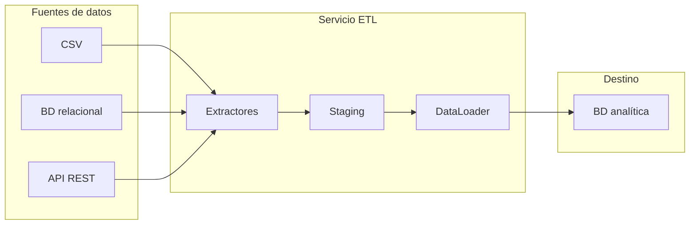

# Diagrama de arquitectura – Proceso ETL (Sistema de Ventas)

## Componentes

- **Servicio ETL (Python):** Pipeline orquestado por `run_etl.py`: extracción desde CSV, BD relacional y API REST; escritura en staging; carga en BD analítica.
- **Fuentes de datos:** CSV (dataset/), base de datos relacional (`fuente_ventas.db`), API REST (mock en FastAPI).
- **Staging:** Base de datos SQLite `data/staging.db` con tablas `staging_productos`, `staging_clientes`, `staging_pedidos`, `staging_detalles`.
- **Base de datos analítica:** SQLite `data/ventas_analitica.db` (modelo estrella: dim_producto, dim_cliente, dim_fecha, hechos_ventas).
- **Dashboard / visualización:** Componente futuro; no implementado en esta actividad.

## Diagrama (Mermaid)

## Atributos de calidad

| Atributo | Cómo se garantiza |
|----------|--------------------|
| **Rendimiento** | Procesamiento por lotes en staging y loader; logging con tiempos de ejecución (`time.perf_counter()`). |
| **Escalabilidad** | Nuevas fuentes = nuevo extractor que implementa la interfaz `Extractor`; configuración en `config.json`. |
| **Seguridad** | Rutas y URL en `config.json`; `config.json` con datos sensibles no se sube a GitHub (solo `config.json.example`). |
| **Mantenibilidad** | Capas separadas: extractors (base, csv, db, api), staging, loader, config, logging; interfaz común para extractores. |
