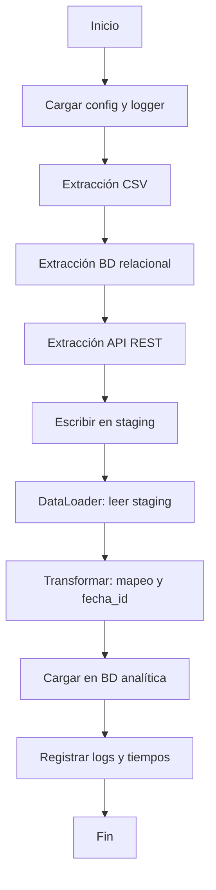

# Diagrama de flujo del proceso ETL

## Flujo general

## Detalle de extracción

Cada extractor (CSV, BD, API) devuelve un diccionario con claves `productos`, `clientes`, `pedidos`, `detalles`. Los datos se consolidan en las tablas de staging; el DataLoader lee desde staging, aplica la transformación (fecha_id = YYYYMMDD, mapeo de columnas) e inserta en la BD analítica.
